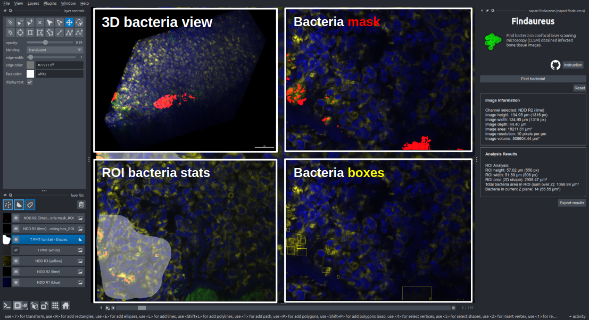

# napari-findaureus

napari-findaureus is a napari plugin that locates *Staphylococcus aureus* (bacteria) in fluorescence-labelled infected bone tissue images acquired with confocal laser scanning microscopy (CLSM).

Compatibility: Python 3.9–3.11 and recent napari releases. The package aims to work with modern napari/Qt stacks; if you encounter compatibility issues, consider creating a fresh environment with a supported Python version.
<p align="center">

</p>

Findaureus is a tool designed to identify bacteria in infected bone tissue images obtained via Confocal Laser Scanning Microscopy (CLSM). This tool can be accessed independently [here](https://github.com/shibarjun/Findaureus). Findaureus has been integrated as a plugin for napari. In addition to its bacteria-locating algorithm, the napari viewer provides enhanced 2D and 3D visualization, region-of-interest-based bacteria finding with relevant stats in the widget, and an `Export results` button to save analysis summaries.

----------------------------------
## Installation
Recommended: create a fresh conda environment using Python 3.11 and install napari in that environment.

Linux / Windows:

```bash
conda create -n napari-findaureus python=3.11
conda activate napari-findaureus
pip install "napari[all]" napari-findaureus
```

macOS:

```bash
conda create -n napari-findaureus python=3.11
conda activate napari-findaureus
conda install -c conda-forge pyqt
pip install "napari[all]" napari-findaureus
```

If you do not already have a suitable test image, download sample data from [Zenodo](https://zenodo.org/doi/10.5281/zenodo.8411791)

## Using napari-findaureus
1. Launch napari from the activated environment:

```bash
napari
```

2. Open your image in napari using `File > Open` or by drag-and-drop.
   - If you do not have an image, download it from Zenodo and open it in napari.

3. Open `Plugins > napari-findaureus` to display the plugin widget.

4. From the napari `layer list` panel select the correct bacteria channel or layer for analysis.

5. Optional ROI analysis:
   - Draw a region of interest using the `Shapes` layer.
   - The analysis will be restricted to the selected ROI when a shape is active.

6. Click `Find bacteria!` to run the detection.

7. Review the results:
   - `Bacteria mask` layer for pixel-wise segmentation
   - `Bounding box` layer for detected objects
   - Counts and area measurements per Z-plane and for the selected ROI or full image
   - Use the `Export results` button (below the Analysis Results box) to save a compact TXT or CSV containing image info and per‑Z‑plane bacteria counts and areas.

8. Use `Reset` to clear results before analyzing another image or ROI.

9. Use the `Instruction` button in the widget for built-in guidance.

----------------------------------
## Contributing
We welcome and appreciate all contributions to the `napari-findaureus` project! Whether it's reporting bugs, suggesting new features, improving documentation, or writing code, your involvement is greatly valued.
When using our dataset or referring to our work, we kindly ask that you acknowledge the dataset and cite the related articles. This helps support our work and allows us to continue improving this project.

Thank you for your interest and support!
## Citations and Dataset
### Findaureus
 Mandal S, Tannert A, Löffler B, Neugebauer U, Silva LB (2024) [Findaureus: An open-source application for locating Staphylococcus aureus in fluorescence-labelled infected bone tissue slices.](https://journals.plos.org/plosone/article?id=10.1371/journal.pone.0296854) PLoS ONE 19(1): e0296854.
### Infected mouse bone tissue
Mandal S, Tannert A, Ebert C, Guliev RR, Ozegowski Y, Carvalho L, Wildemann B, Eiserloh S, Coldewey SM, Löffler B, Bastião Silva L, Hoerr V, Tuchscherr L, Neugebauer U. (2023) [Insights into S. aureus-Induced Bone Deformation in a Mouse Model of Chronic Osteomyelitis Using Fluorescence and Raman Imaging.](https://www.mdpi.com/1422-0067/24/11/9762) International Journal of Molecular Sciences 24(11):9762.

### [Dataset](https://zenodo.org/doi/10.5281/zenodo.8411791)
## Acknowledgements

This project is a part of the European Union's Horizon 2020 research and innovation program under grant agreement No 861122 (ITN IMAGE-IN). We acknowledge support from the Jena Biophotonics and Imaging Laboratory (JBIL), from the European Union via EFRE funds within the Thüringer Innovationszentrum für Medizintechnik-Lösungen (ThIMEDOP, FKZ IZN 2018 0002), the BMBF via the funding program Photonics Research Germany (LPI, FKZ: 13N15713) and via the CSCC (FKZ 01EO1502) and the Institute of Anatomical and Molecular Pathology, University Coimbra, Portugal.
